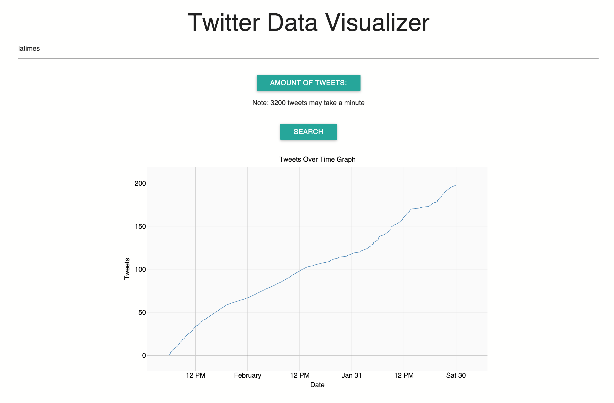
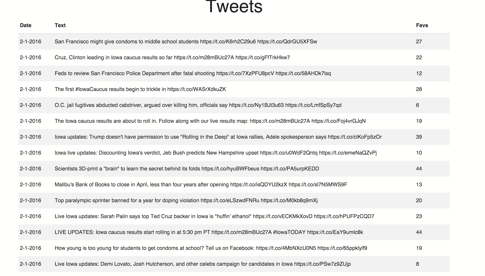

# TwitterDataVisualizer
Displays data from twitter's API in a way thats quick and easy to read

# Installation:
- Requirements:
  - Node.js
  - Twitter API credentials(create a twitter dev profile and make an app)

- Edit models --> search.js and drop in your twitter credentials 
- Save
- Navigate to project in terminal
- Run 'npm start' in terminal 
- Go to localhost:3001 in your browser

# How to use:
- Enter a username to see that user's activity over time.

# How it works:
- This product uses Twitter's API to pull data from twitter.
  - Why?
    - Well we need data don't we?

- D3.js is used to graph the data.
  - Why? 
    - To work with a very powerful and customizable graphing tool. Oh and also to show off our javascript skills.
    
- The UI is done with Basic HTML/JS/CSS along with jQuery
  - Why? 
    - To make the UI update without refreshing the whole page(potential for real time updating of the graph)
